<div align="center">

# SqueezeFeed

### AI-powered news intelligence and social platform

[](https://github.com/Krishnasai8500)
[](https://spring.io/projects/spring-boot)
[](https://fastapi.tiangolo.com)
[](https://react.dev)
[](https://developer.android.com)

[](https://github.com/Krishnasai8500/Squeezefeed1/raw/main/assets/app-debug.apk)

</div>

---

## What is SqueezeFeed?

SqueezeFeed is a full-stack, production-deployed news aggregation and social platform. It scrapes news from across the web, rewrites it into readable human-style summaries using an external AI API, scores each article for virality, and delivers a personalised ranked feed to users — all through a mobile-first Android app.

The platform is built entirely from scratch as a solo project, spanning Java microservices, Python AI pipelines, a React/Capacitor Android app, Kafka event streaming, Celery task scheduling, and Cloudflare tunnel infrastructure.

---

## Live Demo

> **Video walkthrough**

<!-- PLACEHOLDER: Replace with your actual demo video embed or GIF -->
[](assets/demo.mp4)

> *Click the image above to watch the full platform walkthrough.*

---

## Download

<a id="download"></a>

<!-- PLACEHOLDER: Replace href with your actual APK download link -->
[](assets/squeezefeed.apk)

> Android 8.0+ required. Allow installation from unknown sources.

---

## Screenshots

<table>
  <tr>
    <td align="center">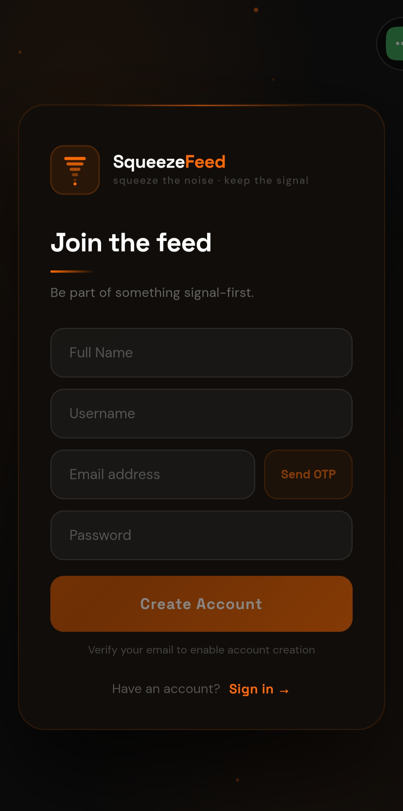<br/><sub>Registration Page</sub></td>
    <td align="center">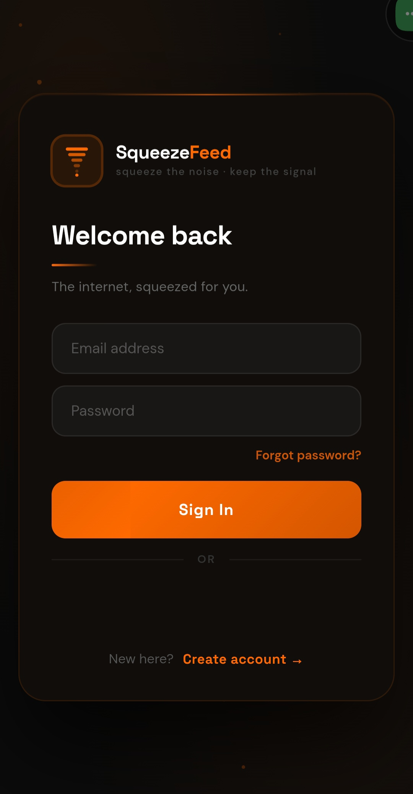<br/><sub>Login Page</sub></td>
    <td align="center">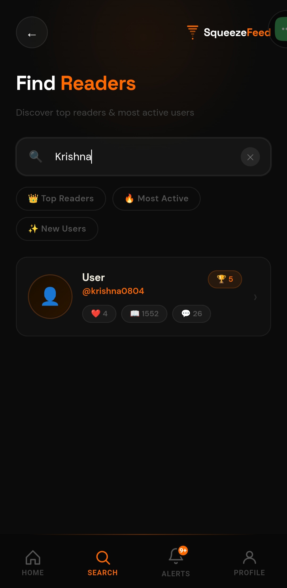<br/><sub>Search Page</sub></td>
    <td align="center">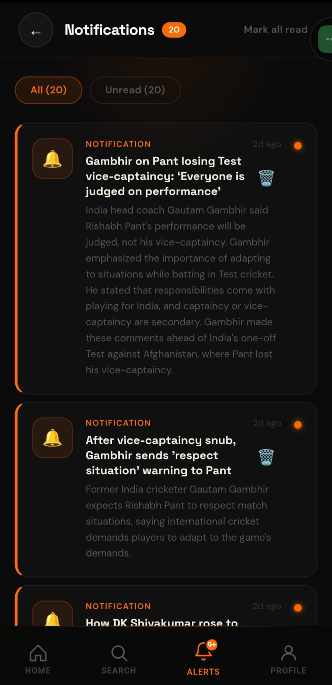<br/><sub>Notification Page</sub></td>
    <td align="center">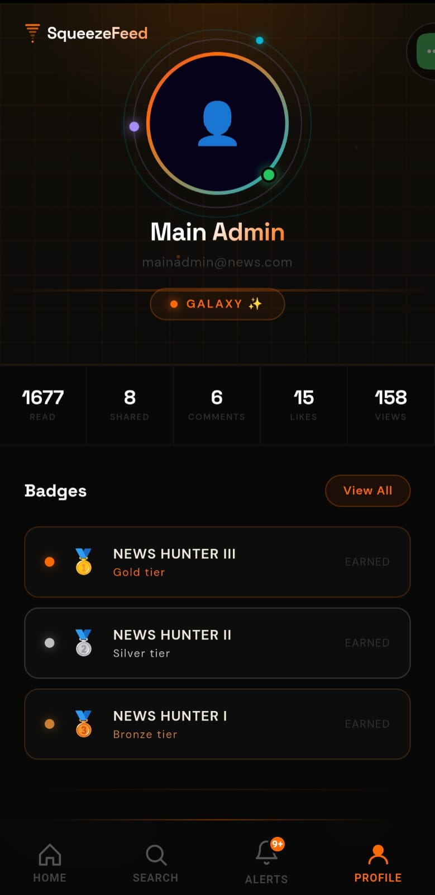<br/><sub>profile page</sub></td>
    <td align="center">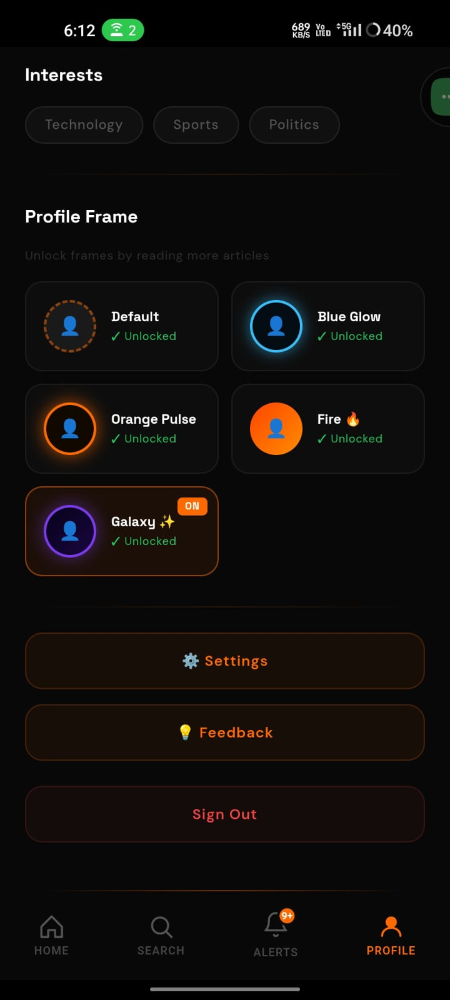<br/><sub>Profile page bottom</sub></td>
  </tr>
  <tr>
    <td align="center">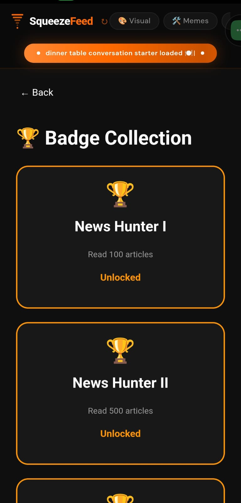<br/><sub>Badges Page</sub></td>
    <td align="center">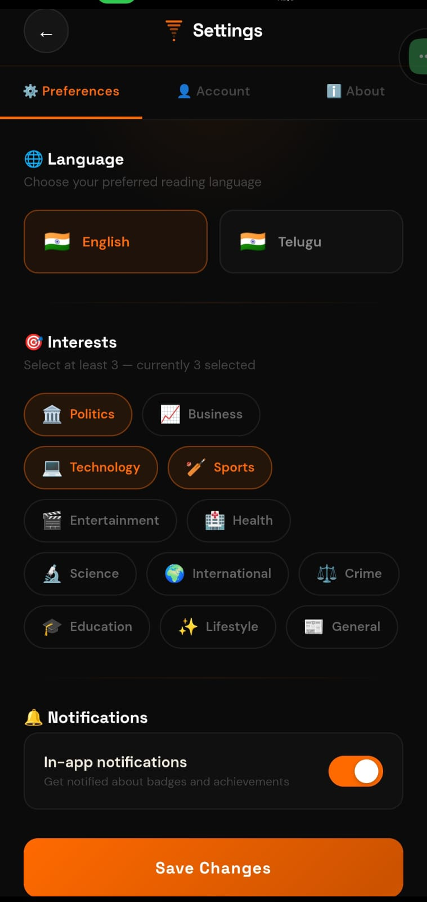<br/><sub>Preference Settings Page</sub></td>
    <td align="center">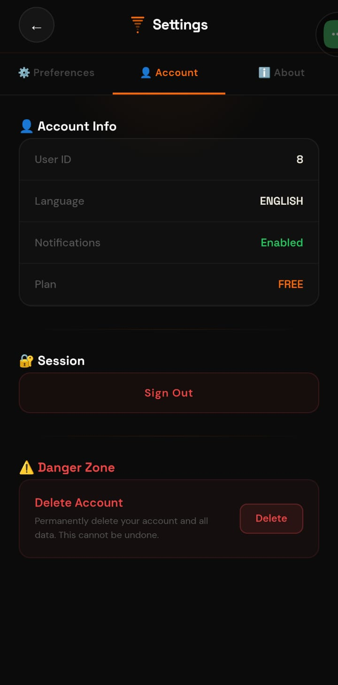<br/><sub>Account Settings Page</sub></td>
     <td align="center">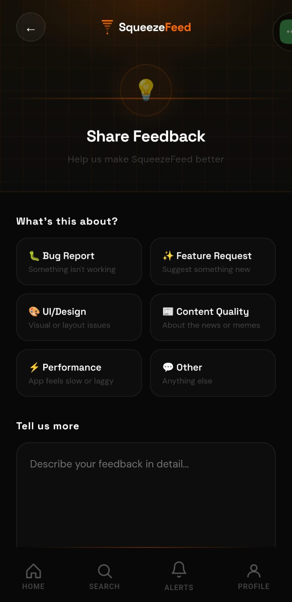<br/><sub>FeedBack Page</sub></td>
    <td align="center">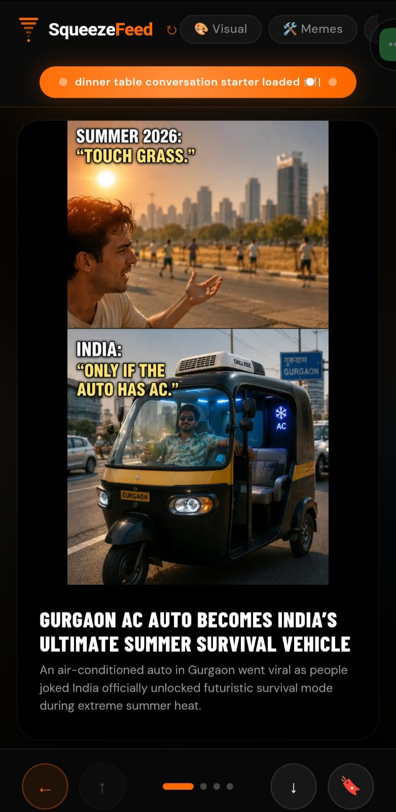<br/><sub>Meme-style article</sub></td>
    <td align="center">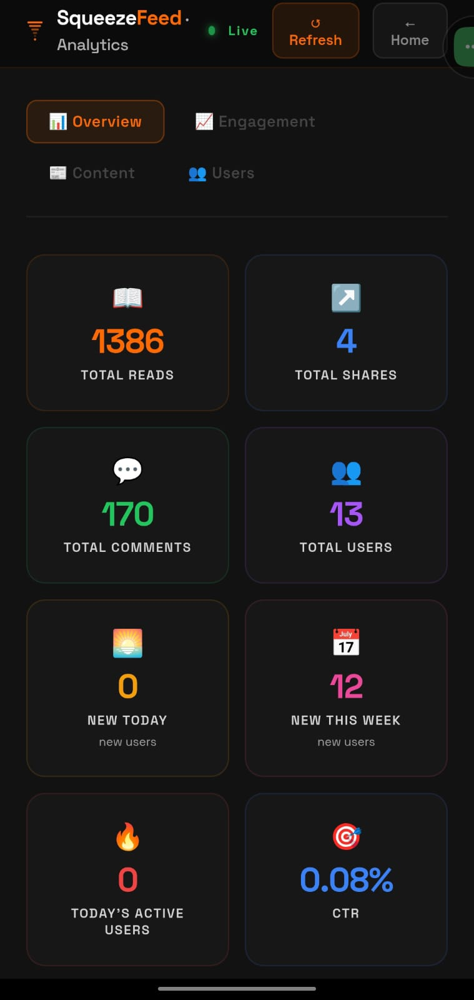<br/><sub>Admin analytics</sub></td>
  </tr>
</table>

> **To add screenshots:** place your images inside an `assets/` folder at the root of this repo and name them as above.

---

## Architecture

The platform is organised into five horizontal layers. Each layer is independent and communicates only through defined interfaces.

### Layer overview

```
┌─────────────────────────────────────────────────────────┐
│           Mobile App  (React + Capacitor)               │
│         Android APK served at nxtbharat.com             │
└──────────────────────┬──────────────────────────────────┘
                       │ HTTPS
┌──────────────────────▼──────────────────────────────────┐
│        Cloudflare Tunnel  →  API Gateway                │
│          api.nxtbharat.com  (port 8080)                 │
└──────────────────────┬──────────────────────────────────┘
                       │ routes
┌──────────────────────▼──────────────────────────────────┐
│              Java Spring Boot microservices             │
│  Auth │ User │ Content │ Media │ Admin/Notif            │
│              ↕ Kafka (Auth + User → Analytics)          │
│              Analytics service                          │
└──────────────────────┬──────────────────────────────────┘
                       │ publishes articles
┌──────────────────────▼──────────────────────────────────┐
│         Python News Pipeline  (Celery + Beat)           │
│  Scraper → Orchestration → Humanization → Sentiment     │
│              Redis  (Celery broker only)                │
└──────────────────────┬──────────────────────────────────┘
                       │ persists
┌──────────────────────▼──────────────────────────────────┐
│                    Data stores                          │
│        PostgreSQL  (all services, separate schemas)     │
└─────────────────────────────────────────────────────────┘
```

---

### Diagram 1 — System layers

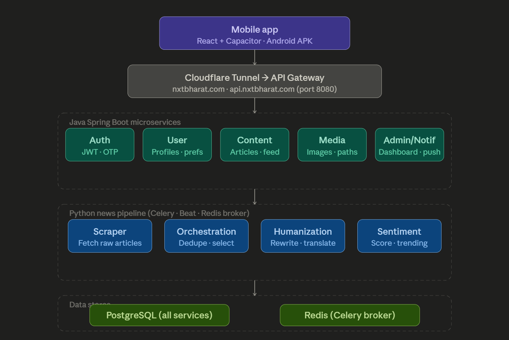

---

### Diagram 2 — Core API services

All five Java services sit behind the API Gateway. Auth and User fire Kafka events to Analytics. Every service has its own PostgreSQL schema.

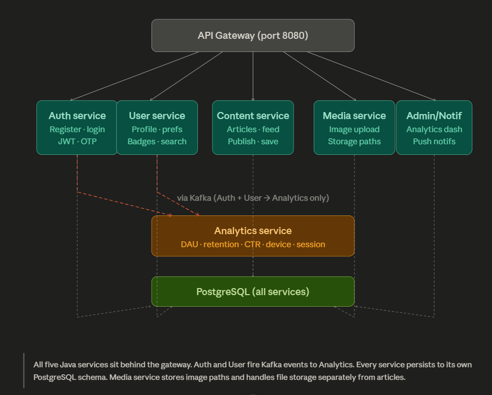

---

### Diagram 3 — News ingestion pipeline

Celery Beat fires a scrape task on a schedule. Each article travels through deduplication, AI rewriting, sentiment scoring, and smart selection before being published to the Content service.

```
Celery Beat (scheduler)
      │
      ▼
Scraper service  ──────────────────  Redis (Celery broker)
      │  fetches raw articles
      ▼
Orchestration service  (Java)
      │  reads unprocessed articles from DB
      ▼
Fingerprint dedup check
      │  seen in last 48 h?
      ├── YES → skip + markProcessed
      └── NO  ↓
Humanization service  (Python)
      │  calls external AI API → rewrites article, viral headline, translations
      ▼
Sentiment service  (Python)
      │  viral score, trending flag, category tags
      ▼
Smart selection
      │  top 3 per trending category · top 2 per standard category
      ▼
Content service  (Java)  →  save to PostgreSQL + record fingerprint
```

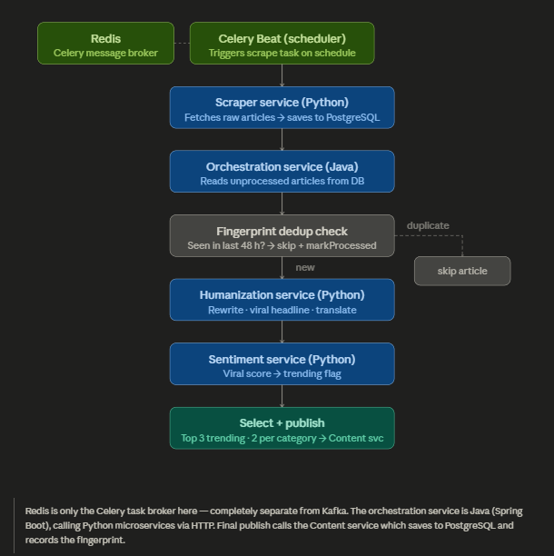

---

### Diagram 4 — Kafka event bus

Kafka connects exactly three services. Auth and User produce events; Analytics consumes them all. Nothing else uses Kafka.

```
Auth service   ──→  user.registered
               ──→  user.login
                                   ┐
User service   ──→  user.profile.view
               ──→  article.click        ──→  Analytics service
               ──→  session.start/end         (consumer group)
               ──→  article.search                │
               ──→  + 7 more topics              ▼
                                          PostgreSQL (metrics)
                                                │
                                          Admin dashboard
```

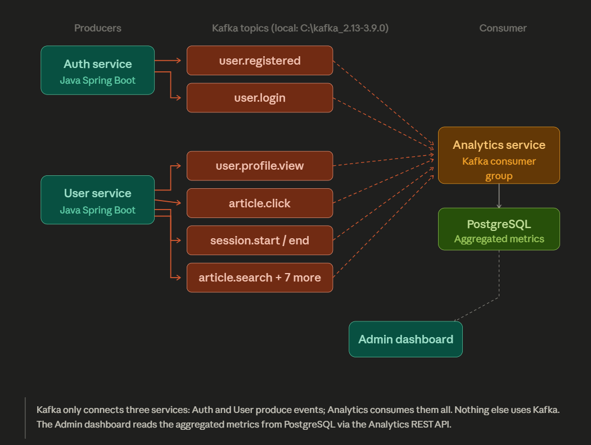

> **Architecture diagram images:** export the four tabs from the interactive architecture diagram and save them as `assets/arch-01-layers.png` through `assets/arch-04-kafka.png`.

---

## How the AI pipeline works

Every article published on SqueezeFeed goes through a multi-stage AI processing pipeline before reaching users.

### 1. Scraping

The Scraper service (Python FastAPI + Celery) fetches raw articles from RSS feeds and news sources on a schedule. Raw content is stored to PostgreSQL with a status of `unprocessed`.

### 2. Deduplication

The Orchestration service builds a semantic fingerprint for each article using the title, description, and category. If a matching fingerprint exists in the last 48 hours, the article is skipped immediately — this prevents duplicate stories from cluttering the feed.

### 3. AI rewriting (Humanization service)

Each new article is sent to the Humanization service, which calls an **external AI API** to produce:

- A rewritten, human-readable summary in a natural tone
- A viral headline optimised for engagement
- Translated titles and summaries in multiple regional languages (English, Hindi, Telugu, Tamil)

The external API handles all heavy language generation. The Humanization service acts as an orchestration wrapper around it, validating translation quality and falling back to the original title when translation confidence is low.

### 4. Sentiment scoring

The Sentiment service scores each rewritten article for virality using category classification, entity extraction, keyword matching with multi-word phrase bonuses, and freshness decay. Articles scoring ≥ 0.7 are flagged as trending.

### 5. Smart selection

Before publishing, the Orchestration service groups articles by category. It selects the top 3 highest-scoring articles from trending categories and the top 2 from standard categories. This controls diversity and prevents any single topic from flooding the feed.

### 6. Personalised delivery

The Content service ranks the published feed per user using a combination of signals:

| Signal | Detail |
|---|---|
| Preferred categories | Boost for saved user interests |
| Engagement history | Ranking based on reading patterns |
| City boost | +15 relevance score for local city match |
| State boost | +5 relevance score for state-level match |
| Viral score | Trending signal from sentiment layer |
| Semantic tags | NLP topic matching |

---

## Features

### News feed
- Infinite scroll, dark-themed article cards
- AI-rewritten titles and humanized summaries on every card
- Per-card actions: comment, save, share, read full article
- Meme-style article rendering for viral/entertainment category (AI-generated images via Media service)
- Language filter: English, Hindi, Telugu, Tamil

### Social and engagement
- Per-article comment drawer with emoji reactions
- Article saves, shares, and profile likes tracked in real time
- User search and public profiles

### Gamification (badge system)

Users earn badges by hitting real engagement milestones. No XP bars or streaks — badges unlock the moment thresholds are crossed.

| Badge | Milestone |
|---|---|
| News Hunter I / II / III | Read 100 / 500 / 1500 articles |
| Signal Booster I | Share 10 articles |
| Debate Lord I | Post 25 comments |
| Known Face I | Receive 200 profile visits |
| Most Liked I | Receive 25 profile likes |
| Overachiever | Unlock all badge paths |

Locked badges are visible as progression goals. Unlocked badges display with a gold highlight. Profile frames (e.g. `galaxy`) are cosmetic rewards earned through progression.

### Analytics dashboard (admin)
- Daily active users (DAU)
- Retention, session duration, CTR
- Device breakdown, referral sources, search queries
- All powered by 13 Kafka-based event types consumed by the Analytics service

### Mobile app (Android)
- Built with React + Vite + Capacitor for native Android packaging
- Multi-step onboarding: language → category interests → notifications → GPS location (Nominatim reverse geocoding)
- Dark brand theme throughout with `#FF6A00` orange accent
- Bottom navigation: Home · Search · Feed · Profile

---

## Microservices reference

### Java Spring Boot services

| Service | Port | Role |
|---|---|---|
| API Gateway | 8080 | Single entry point, routing, JWT validation |
| Auth service | — | Registration, OTP verification, JWT issuance |
| User service | — | Profiles, preferences, engagement stats, badge tracking |
| Content service | — | Article storage, personalised feed, ranking |
| Media service | — | Image upload, AI-generated media, storage paths |
| Admin / Notification | — | Analytics dashboard API, push notifications |
| Analytics service | — | Kafka consumer, DAU/retention/CTR aggregation |

### Python AI services

| Service | Technology | Role |
|---|---|---|
| Scraper service | FastAPI + Celery | RSS ingestion, scheduled scraping |
| Humanization service | FastAPI | External AI API integration, rewriting, translation |
| Sentiment service | FastAPI | Viral scoring, category classification, entity tagging |

---

## Tech stack

| Layer | Technology |
|---|---|
| Frontend | React, Vite, Capacitor (Android) |
| Backend | Java 17, Spring Boot 3, Spring Cloud Gateway |
| AI pipeline | Python 3, FastAPI, External AI API, HuggingFace |
| Event streaming | Apache Kafka (local binary) |
| Task scheduling | Celery + Celery Beat |
| Message broker | Redis (Celery only) |
| Database | PostgreSQL |
| Infrastructure | Cloudflare Tunnel, Docker (Redis) |
| Deployment | Self-hosted, Cloudflare-exposed |

---

## Infrastructure

```
Local machine
├── Java services          (Spring Boot, port 8080 via API Gateway)
├── Python services        (FastAPI, various ports)
├── Apache Kafka           (C:\kafka_2.13-3.9.0, local binary)
├── Redis                  (Docker container, Celery broker)
└── PostgreSQL             (each service has its own schema)

Cloudflare Tunnel
├── api.nxtbharat.com   →  port 8080  (API Gateway)
└── media.nxtbharat.com →  port 8089  (Media service)
```

---

## Project status

**Active development.** Core pipeline is fully functional and deployed.

### Implemented
- RSS ingestion and multi-source scraper pipeline
- External AI API integration for humanized summaries and translations
- Viral scoring, trending detection, category classification
- Category-aware orchestration batching with fingerprint deduplication
- Personalised feed ranking (categories, location boost, viral score)
- Kafka-based analytics with 13 event types
- Gamification system (badge unlocks)
- Infinite scroll feed with meme-style article rendering
- Multi-step onboarding with GPS-based location
- Admin analytics dashboard
- Android APK via Capacitor

### Roadmap
- Local news tab (city-scoped feed)
- User behaviour embeddings and recommendation learning
- Trend prediction models
- Multilingual feed pipelines
- AI-generated explainer articles
- Advanced personalisation ranking models

---

## Repository structure

```
squeezefeed/
├── api-gateway/                  Java — Spring Cloud Gateway
├── auth-service/                 Java — JWT, OTP, registration
├── user-service/                 Java — profiles, badges, Kafka producer
├── content-service/              Java — articles, personalised feed
├── media-service/                Java — image storage and serving
├── admin-notification-service/   Java — dashboard API, push notifications
├── analytics-service/            Java — Kafka consumer, metrics
├── news-orchestration-service/   Java — ingestion pipeline coordinator
├── scraper-service/              Python — Celery scraping pipeline
├── humanization-service/         Python — external AI API wrapper
├── sentiment-service/            Python — scoring and classification
└── frontend/                     React + Vite + Capacitor (Android)
```

> Repositories are private. Code samples and architecture diagrams are available on request.

---

## Author

**Krishna Sai** — [@Krishnasai8500](https://github.com/Krishnasai8500)

Built and maintained as a solo full-stack project.

---

<div align="center">

*SqueezeFeed — the news, squeezed down to what matters.*

</div>
